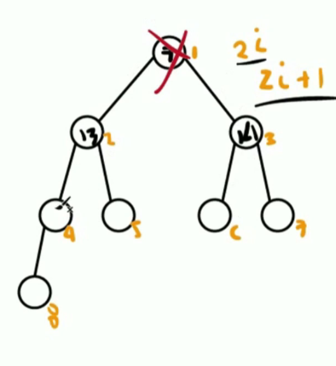

# Heaps o monticulo

Es un arbol binario que cumple con ciertas caracteristicas

- 2 personalidades
    - ***Min-heap:*** El elemento de cada nodo tiene que ser menor que los elementos de sus 2 hijos
    - ***Max-heap:*** El elemento de cada nodo tiene que ser mayor que los elementos de sus 2 hijos

Los Heaps son bastante complicados como arboles lo mas comun es trabajarlo como arreglos pero para encontrar el numero mayor o el numero menor solo tenemos que tomar el primer elemento o el ultimo, ya que estan ordenados de esta forma.

Ahora para poder saber quien es tu padre dentro del arreglo se usa esta formula.

***Math.ceil(i/2)***.

Math.ceil es para redondear hacia abajo y i/2 es el indice dividido 2, esto nos daria su padre, hay que tomar en cuenta que no se toma el indice cero si no el indice 1

La distribucion de los nodos se hace de la siguiente forma 

