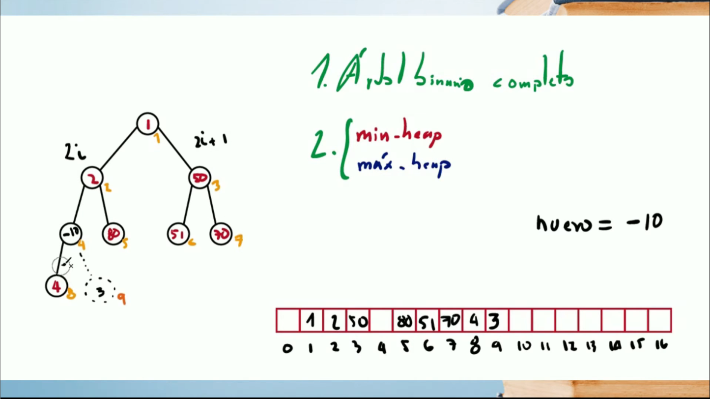
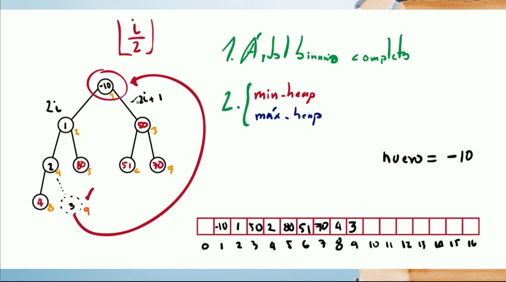
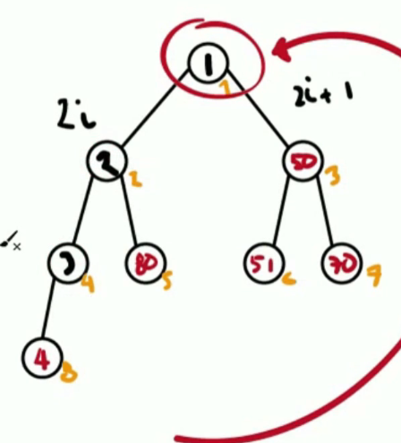

# Operaciones Basicas

## Agregar un nuevo elemento

aqui queremos agregar el 10, pero como se puede ver el arbol es un min-heap entonces el 3 deberia de ser menor a sus 2 hijos pero no es menor al -10 entonces se cambian esos 2 elementos.

Ahoar ya movido el 10, tenemos el problema que el nodo de arriba es mayor, entonces tambien hacemos ese cambio pero tambien es menor al 1 entoneces al final nos queda asi.

## Remover
Siempre remover la raiz del arbol el elemento mas grande o mas pequeño de todos.

Ahora tomamos el ultimo elemento y lo cambiamos con la raiz de sta forma, Aunque no se cumpla la propiedad.

Ahora sustituimos por el 1 pero, debemos de comprobar los 2 lados y ver cual es el numero mas pequeño y cambiarlo por ese.

Luego comprobamos la propiedad y lo seguimos bajando hasta que se cumpla o hasta que sea un nodo hoja
