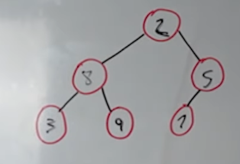
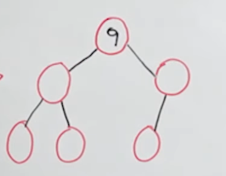
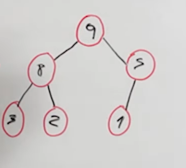
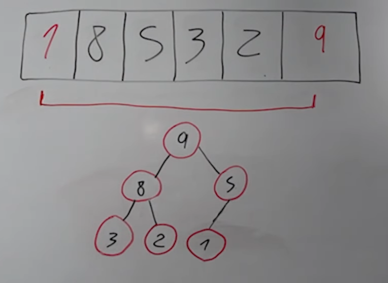
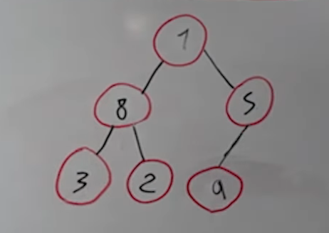
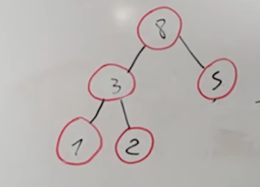
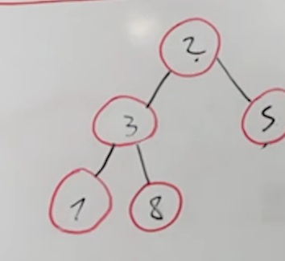
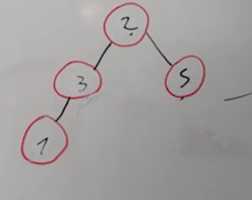

# Build Max Heap

Crea el max-heap, asumiendo que el array esta desordenado


``` js
[2,8,5,3,9,1] -> [9,8,5,3,2,1]
```

primero metemos los datos en esta secuencia, raiz,izquierda,derecha luego llenamos los hijos de izquierda a derecha tambien.


Como podemos ver, este arbol esta desornado.

El siguiente paso es localizar el valor mayor en este caso el #9.



el 9 es el root y apartir de aqui ordenamos los demas.



# Heap Sort

Ahora para resolver este arbol usando Heap Sort.

1. Swap: Cambiamos el root con el ultimo que tengamos en nuestra lista.





con esto descartamos al 9 pero necesitamos ordenar de esta forma



ahora hacemos un swap con el 2



ahora eliminamos el 8

