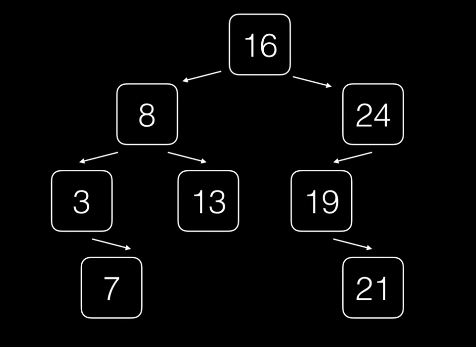

# Arbol de busqueda binario (BTS)

Un arbol es de busqueda cuando su raiz R no esta vacia.

- Si tiene un subarbol izquierdo y este es menor a R, a su ves este subarbol tambien es de busqueda.

- Si tiene un subarbol derecho y este es mayor a R, a su ves este subarbol tambien es de busqueda.


***Ejemplo:***


## Elementos comparables

- Debe de haber una forma de ordenar los elementos

***Ejemplo:***
 - Almacenar enteros de menor a mayor.
 - Almacenar caracteres por oden lexicografico.
 - Almacenar objetos que se puedan identificar por una clave que si sea ordenable: libos usando clave ISBN, Personas usando el codigo de empleado, etc...

 ## Estructuras


 ```js
class Nodo{
    value:k
    left,rigth = nodo
}

class Arbol {
    raiz:nodo
}

 ```

 Recursiva

 ``` js
class Nodo{
    value:k
    left,rigth = nodo
}

TIPO NODO ARBOL

 ```

