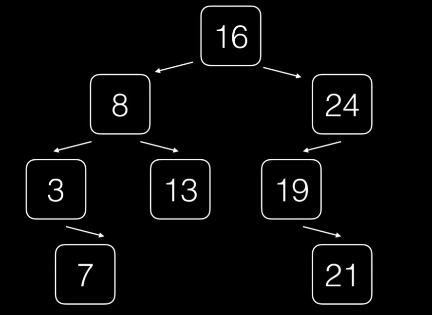
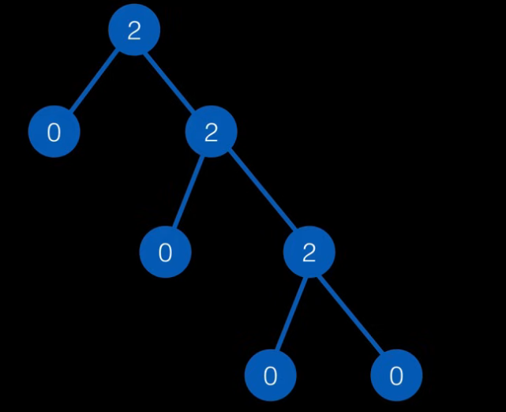
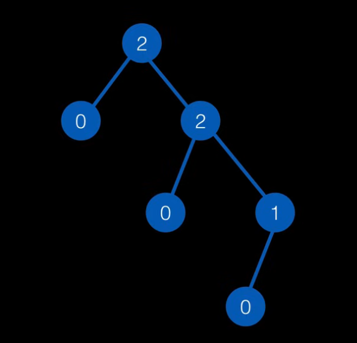

# Arboles Binarios


- Son arboles de orden 2
- Cada nodo puede tener maximo 2 hijos

 ***Ejemplo:***
 

 ## Tipos de arboles binario

 ### Full Complete
 - Todos los arboles tienen
    - 0 hijos -> LLamados hojas
    - 2 hijos

    
***Ejemplo:***


### Complete binary tree

- El ultimo nivel puede permitirse el precindir de alguno de los hijos.
- El que puede faltar es el hijo izquierdo

***Ejemplo:***


### Arboles degenerados

- Cada nodo solo tiene un hijo
- Se comportan como listas

***tip:*** Son una lista enlazada simple

### Arboles balancedos

- Intentar mantener la profundidad de 2 subarboles la menor posible

- El balanceo hace que algunas operaciones sean mas eficientes

- Las reglas de balanceo cambian en base a la tecnica a usar.

## Cambios en la estructura

``` js

class NODO_BT{
    constructor(value) {
        this.value = value
        //cada uno apunta a su padre 
        this.left  = null    
        this.rigth = null 
    }

}

```

## Operaciones

- Insercion
- Eliminacion
- Locaclizacion
- Recorrido


## Recorrido

Existen 4 formas de recorrer un arbol

- En anchura

#### ***Profundidad***

- En preorden   
- En inorden     
- En postOrden  

### En anchura

- Procesamos todos los elementos del mismo nivel.
- Cuando terminamos con un nivel, pasamos al otro.

***Ejemplo:***


Este seria la sucesion a seguir

<center>

***Nivel 1:***

16

***Nivel 2:***

 8 -- 24 
 
***Nivel 3:***

3 -- 13 -- 19 

***Nivel 4:***

7 -- 21
</center/>


## Recorridos en profundidad

- Nodo izquierdo y derecho como subarboles
- Se procesan: 
    - Raiz
    - Izquierdo
    - Derecho
- Dependiendo del recorrido, puede variar el metodo.

### Preorden

- Procesamos raiz
- Arbol Izquierdo
- Arbol Derecho

### Inoder

- Arbol Izquierdo
- Procesamos raiz
- Arbol Derecho

### PostOrden

- Arbol Izquierdo
- Arbol Derecho
- Procesamos raiz


## ¿Cuando terminamos de recorrer un arbol? 

Cuando ese subarbol valga null