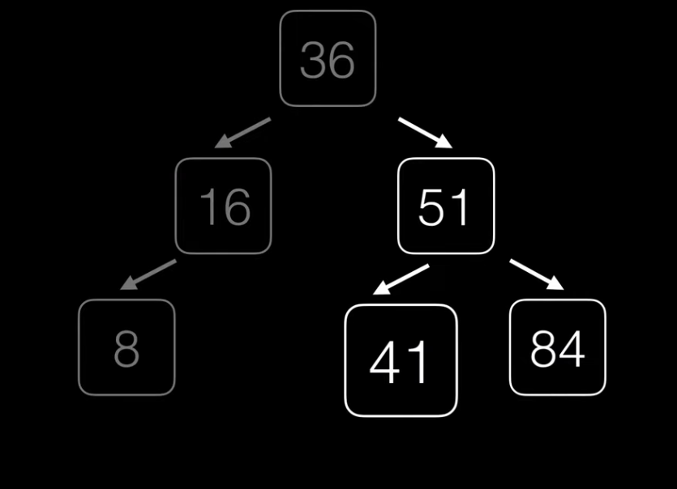
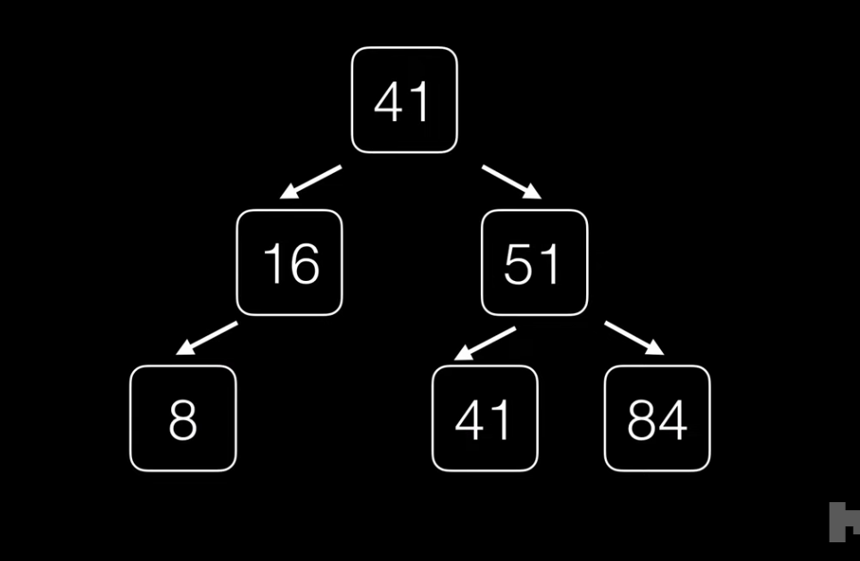
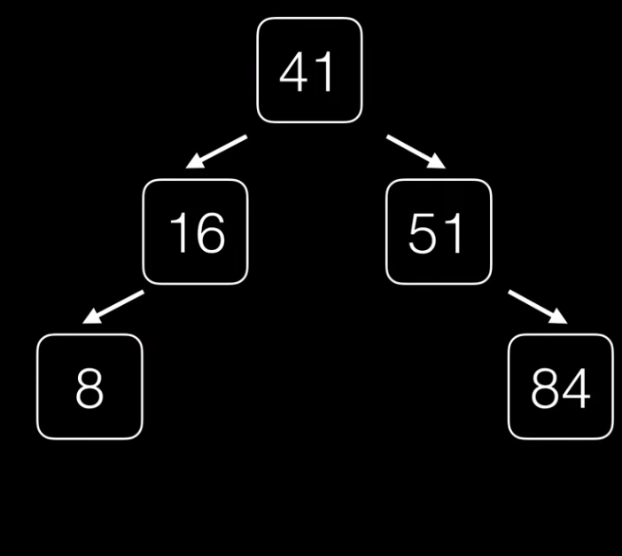

# Eliminar

- Buscamos el nodo
- Casos:
    - Si es hoja solo lo eliminamos
    - Puede tener 2 hijos
    - puede tener 1 hijo

## Eliminar un nodo hoja

Eliminamos el nodo haciendo que el padre apunte a null y el nodo hoja colocar su valor a null esto dependiendo del lenguaje.

## Eliminar con un 1 hijo

-  No podemos perder las conexiones mas profundas
-  Guardamos al hijo del nodo a elminar y el padre del nodo a eliminar ahora apuntara al hijo guardado del nodo a eliminar

## Eliminar con 2 hijos

- No podemos perder informacion
- Debemos reestructurar el arbol
- Ha que promover alguno de los nodos como nueva raiz.

### Regla

- Buscamos el nodo mas a la derecha del subarbol izquierdo.

- Tambien podemos buscar el nodo mas a la izquierda en el subarbol derecho.

- Cuando encontremos M es decir el valor que reemplazara al nodo entonces lo intercambiamos y ahora buscamos M recursivamente para eliminarlo.

***Ejemplo Minimo del lado derecho:***

- Buscamos el nodo mas a la izquierda del lado derecho

- Remplezamos con las raiz nos quedara duplicado

- Ahora eliminamos el 41

